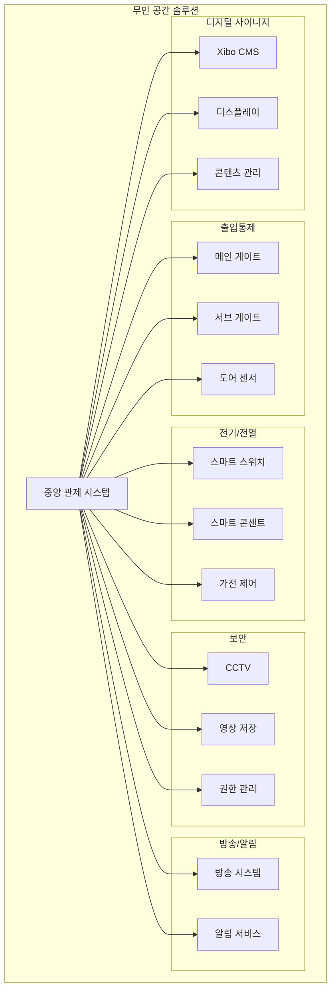

# 무인 공간 솔루션

## 개요

무인 공간 솔루션은 사무실, 매장, 공유 공간 등을 원격으로 관리하고 자동화할 수 있는 통합 관리 시스템입니다. 출입통제, 전기/전열 제어, 보안 시스템을 하나의 플랫폼에서 관리할 수 있습니다.

## 주요 기능

### 🚪 [출입통제 시스템](./access-control)
- 메인/서브 게이트 관리
- 다양한 인증 방식 지원
- 실시간 출입 모니터링

### ⚡ [전기/전열 제어](./electrical-control)
- 스마트 스위치/콘센트 관리
- 가전제품 원격 제어
- 에너지 사용량 모니터링

### 🔒 [보안 시스템](./security-system)
- CCTV 통합 관리
- 실시간 영상 모니터링
- 권한별 접근 제어

### 📢 [방송/알림 시스템](./broadcast-notification)
- 공간 내 방송 시스템
- 긴급 알림 기능
- 스케줄 방송 관리

### 📺 Xibo 디지털 사이니지
#### [시스템 관리자용 가이드](./xibo-signage)
- 오픈소스 디지털 사이니지 플랫폼
- 시스템 설치 및 설정
- API 연동 및 고급 기능

#### [일반 사용자용 가이드](./xibo-user-guide)
- 콘텐츠 업로드 및 관리
- 레이아웃 만들기
- 스케줄 설정하기
- 실시간 화면 변경

## 시스템 아키텍처

## 도입 효과

### 비용 절감
- **인건비 절감**: 무인 운영으로 인건비 최대 70% 절감
- **에너지 절약**: 자동 제어로 에너지 비용 30% 절감
- **운영 효율화**: 원격 관리로 관리 비용 50% 절감

### 운영 효율성
- **24/7 운영**: 365일 24시간 무인 운영 가능
- **원격 관리**: 어디서나 실시간 관리 가능
- **자동화**: 스케줄 기반 자동 운영

### 보안 강화
- **실시간 모니터링**: 24시간 보안 감시
- **접근 제어**: 권한별 출입 관리
- **기록 관리**: 모든 이벤트 자동 기록

## 적용 분야

| 분야 | 활용 사례 |
|------|----------|
| **오피스** | 무인 사무실, 공유 오피스, 회의실 |
| **리테일** | 무인 매장, 편의점, 카페 |
| **교육** | 스터디 카페, 독서실, 강의실 |
| **헬스케어** | 피트니스센터, 요가원, 필라테스 |
| **물류** | 무인 택배함, 물류 창고 |
| **숙박** | 무인 호텔, 게스트하우스, 펜션 |

## 시작하기

1. [시스템 요구사항](./requirements) 확인
2. [설치 가이드](./installation-guide) 따라하기
3. [초기 설정](./initial-setup) 진행
4. [운영 가이드](./operation-guide) 참고

## 기술 지원

- **기술 문의**: uriggiridev@gmail.com

::: tip 데모 체험
무인 공간 솔루션을 직접 체험해보고 싶으신가요? [데모 신청하기](https://demo.uriggiri.com)
:::